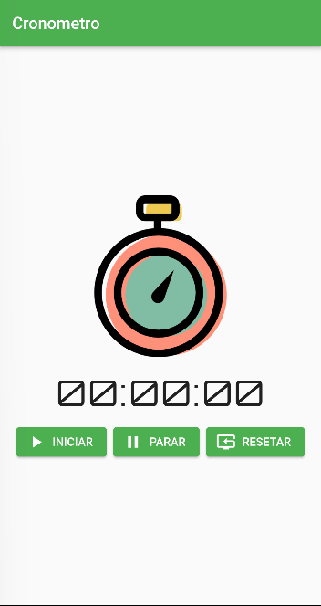
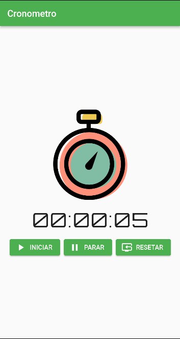

# cronometro

Este aplicativo simples feito em Flutter tem o objetivo de exibir, de forma simples como realizar a implementação de um cronometro onde o tempo pode ser iniciado, parado e zerado.





### Pré-requisitos para usar o projeto

- Flutter: 3.00 ou superior

### Gerando versão de build

```
flutter clean && flutter pub get && flutter build apk --release
```

### Conceitos a serem observados neste projeto

- Uso da pasta assets como referência no arquivo pubspec.yaml
- Importação e uso de fontes personalizadas
- Separação de pastas e organização estrutural
- Utilização de imagens como recursos
